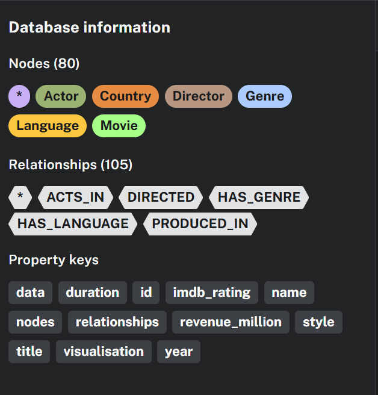
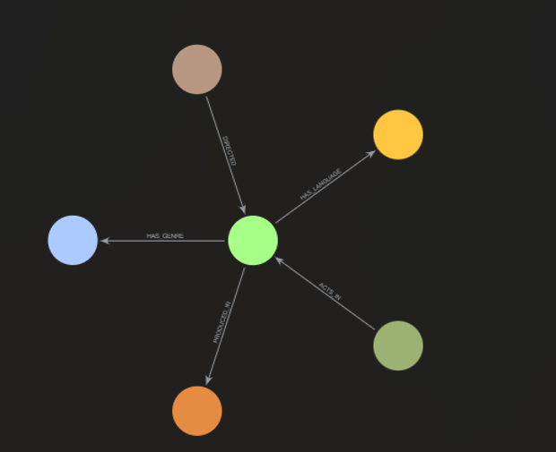

# Movie Graph Project

This repository contains the code and resources for a project that utilizes a Graph Database (likely Neo4j) to model and query movie data. The project demonstrates how to structure complex relationships and retrieve insightful data using graph queries.

---

## 🚀 Key Files

* **`Movie_graph.ipynb`**: The main Jupyter Notebook containing the code for creating the Neo4j database schema, importing data, and defining various Cypher queries.
* **`Movie_Graphdbqa.ipynb`**: A notebook demonstrating a Question-Answering (QA) system built on top of the graph database.
* **`requirements.txt`**: Lists all necessary Python dependencies (e.g., `langchain`, `neo4j`, etc.).
* **`screenshots/`**: Directory containing visual examples of the project's output and functionality.

---

## 🖼️ Project Screenshots

Below are a few screenshots showcasing the results and query outputs from the notebooks.

### 1. Example Query Output (Cypher Queries)

This screenshot displays the output of various complex Cypher queries used to analyze the movie data, demonstrating the power of graph traversal.



### 2. DBQA System Demonstration

This image illustrates the Question-Answering system's ability to interpret natural language questions and return accurate answers by querying the Neo4j graph database.



---

## 🛠️ Setup and Installation

1.  **Clone the repository:**
    ```bash
    git clone your-repo-name
    cd your-repo-name
    ```

2.  **Install dependencies:**
    ```bash
    pip install -r requirements.txt
    ```

3.  **Run Neo4j:** Ensure you have a Neo4j instance running (either locally or in the cloud).

4.  **Execute Notebooks:** Open and run the cells in `Movie_graph.ipynb` to set up the database, then run `Movie_Graphdbqa.ipynb` to test the QA system.
